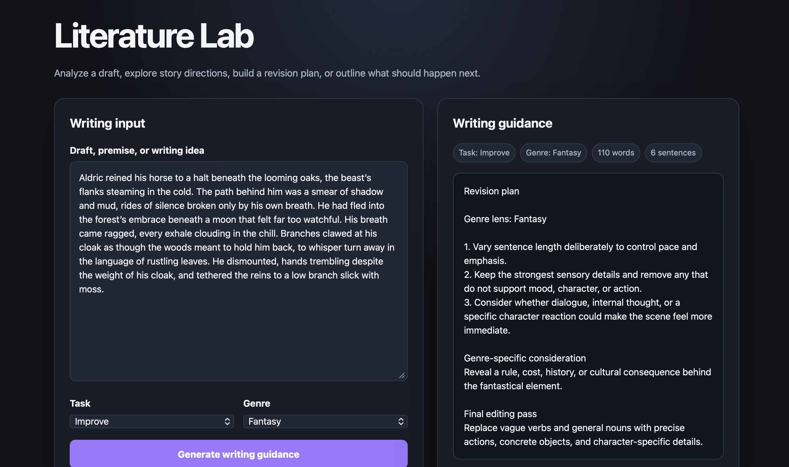

# Literature Lab

[](https://github.com/fierce-bri/Literature-Lab-AI-chatbot-/actions/workflows/django.yml)
[](https://github.com/fierce-bri/Literature-Lab-AI-chatbot-/actions/workflows/docker.yml)

Literature Lab is a Django creative-writing assistant with a browser interface and JSON API. It accepts a draft, premise, scene, or story idea and returns structured, genre-aware writing guidance.

The current version is **deterministic and explainable**. It does not claim to use GPT or another external language model. Instead, it provides a reliable local service layer that can later be extended with an optional LLM provider.

## Demo

<p align="center">
  
</p>

<p align="center">
  <em>
    Literature Lab generating genre-aware writing guidance through
    the Django browser interface.
  </em>
</p>

## The Problem It Solves

Writers often need a structured way to review a draft, explore possible story directions, identify revision priorities, or decide what should happen next.

Literature Lab provides four focused workflows:

- **Analyze** — measures the draft and identifies revision priorities
- **Brainstorm** — suggests conflict, character, and discovery directions
- **Improve** — creates a practical revision plan
- **Continue** — produces a next-scene blueprint

Guidance can be tailored to:

- General
- Fantasy
- Science Fiction
- Mystery
- Romance
- Horror
- Literary Fiction

## What I Designed and Implemented

- A reusable writing-assistant service separated from Django views
- Shared form validation for the browser interface and JSON API
- A responsive browser-based writing interface
- Versioned health and writing-assistant API endpoints
- Input limits and rejection of unsupported or unexpected request fields
- Structured responses with task, genre, word count, and sentence count
- Persistent interaction history using Django models and migrations
- UUID request identifiers and timestamps for traceability
- Read-only Django admin access to interaction history
- Environment-based Django security and deployment settings
- Gunicorn and WhiteNoise production configuration
- A non-root Docker image with automatic migrations and static-file collection
- Automated service, form, model, browser, API, migration, and container tests

## Architecture

```text
Browser form or JSON request
            │
            ▼
Django validation layer
            │
            ▼
WritingAssistantService
            │
            ├── Analyze
            ├── Brainstorm
            ├── Improve
            └── Continue
            │
            ▼
WritingInteraction database record
            │
            ▼
HTML page or JSON response
```

The writing logic is contained in `chatbot/services.py` and does not depend on the HTTP layer. Django handles routing, validation, persistence, templates, administration, and deployment concerns.

## Routes

| Method | Path | Purpose |
|---|---|---|
| `GET` | `/` | Display the browser writing assistant |
| `POST` | `/` | Submit the browser writing form |
| `GET` | `/api/v1/health/` | Check application health and service mode |
| `POST` | `/api/v1/respond/` | Generate writing guidance from JSON |
| `GET` | `/admin/` | View interaction history through Django admin |

## JSON API

### Request

```http
POST /api/v1/respond/
Content-Type: application/json
```

```json
{
  "text": "The traveller reached the abandoned city. Rain darkened the road.",
  "task": "brainstorm",
  "genre": "fantasy"
}
```

### Successful Response

```json
{
  "request_id": "b1240764-54d8-4f61-81f3-09d59efc323f",
  "response": "Story-development directions...",
  "task": "brainstorm",
  "genre": "fantasy",
  "word_count": 10,
  "sentence_count": 2,
  "created_at": "2026-08-20T02:15:30.154321+00:00"
}
```

### Validation Behaviour

The endpoint:

- requires `Content-Type: application/json`;
- requires the JSON body to be an object;
- rejects unknown properties;
- limits text to 10,000 characters;
- validates task and genre values;
- does not store failed requests.

### Supported Task Values

```text
analyze
brainstorm
improve
continue
```

### Supported Genre Values

```text
general
fantasy
science-fiction
mystery
romance
horror
literary-fiction
```

## Run Locally

### Requirements

- Python 3.11 or newer
- `pip`

### macOS or Linux

```bash
python3 -m venv .venv
source .venv/bin/activate

python -m pip install --upgrade pip
python -m pip install -r requirements.txt

cd literature_lab
python manage.py migrate
python manage.py runserver
```

### Windows PowerShell

```powershell
py -m venv .venv
.\.venv\Scripts\Activate.ps1

python -m pip install --upgrade pip
python -m pip install -r requirements.txt

cd literature_lab
python manage.py migrate
python manage.py runserver
```

Open:

```text
http://127.0.0.1:8000/
```

The local development settings include a development-only fallback key and enable debug mode by default. Real deployments must provide their own environment variables.

## Environment Configuration

The repository includes `.env.example` as a reference for supported values:

```text
DJANGO_DEBUG
DJANGO_SECRET_KEY
DJANGO_ALLOWED_HOSTS
DJANGO_CSRF_TRUSTED_ORIGINS
DJANGO_DATABASE_PATH
```

Django reads these values from the process environment. The project does not automatically load a `.env` file.

For a deployment, at minimum set:

```bash
export DJANGO_DEBUG=false
export DJANGO_SECRET_KEY="replace-with-a-long-random-secret"
export DJANGO_ALLOWED_HOSTS="your-domain.example.com"
export DJANGO_CSRF_TRUSTED_ORIGINS="https://your-domain.example.com"
```

## Example API Call

```bash
curl --request POST \
  --url http://127.0.0.1:8000/api/v1/respond/ \
  --header "Content-Type: application/json" \
  --data '{
    "text": "The traveller reached the abandoned city. Rain darkened the road.",
    "task": "brainstorm",
    "genre": "fantasy"
  }'
```

Health check:

```bash
curl --fail http://127.0.0.1:8000/api/v1/health/
```

Expected response:

```json
{
  "status": "ok",
  "service": "literature-lab",
  "mode": "deterministic"
}
```

## Interaction History

Successful browser and API requests are saved as `WritingInteraction` records containing:

- request UUID;
- original input;
- generated response;
- task and genre;
- browser or API source;
- word and sentence counts;
- creation timestamp.

The Django admin presents this data as read-only history. Records cannot be manually added, edited, or deleted through the admin interface.

Create an admin user locally with:

```bash
cd literature_lab
python manage.py createsuperuser
```

Then open:

```text
http://127.0.0.1:8000/admin/
```

## Run the Tests

Install the development dependencies:

```bash
python -m pip install -r requirements-dev.txt
```

Run Django checks, migration validation, and the full test suite:

```bash
cd literature_lab

python manage.py check
python manage.py makemigrations --check --dry-run
python manage.py migrate --noinput
python manage.py test --verbosity 2
```

Run with coverage:

```bash
python -m coverage run --source=chatbot manage.py test
python -m coverage report --show-missing
```

The automated tests cover:

- all writing-assistant tasks and genres;
- service input normalization and limits;
- Django form validation;
- model choices, UUIDs, ordering, and display behaviour;
- browser rendering and form submissions;
- JSON content-type and body validation;
- unsupported and unexpected values;
- health endpoint behaviour;
- interaction persistence;
- conversion of service errors into user-facing responses.

## Run with Docker

Build the image:

```bash
docker build --tag literature-lab .
```

Create a persistent SQLite volume:

```bash
docker volume create literature-lab-data
```

Run the application:

```bash
docker run --rm \
  --name literature-lab \
  --publish 8000:8000 \
  --env DJANGO_DEBUG=false \
  --env DJANGO_SECRET_KEY="replace-with-a-long-random-secret" \
  --env DJANGO_ALLOWED_HOSTS="127.0.0.1,localhost" \
  --env DJANGO_DATABASE_PATH="/data/db.sqlite3" \
  --mount source=literature-lab-data,target=/data \
  literature-lab
```

The container entrypoint:

1. prepares the database directory;
2. applies Django migrations;
3. collects static files;
4. starts Gunicorn.

The image runs as an unprivileged user and includes a health check against:

```text
/api/v1/health/
```

## Continuous Integration

### Django Workflow

The Django workflow runs on Python 3.11, 3.12, 3.13, and 3.14. It:

- installs runtime and development dependencies;
- runs Django configuration checks;
- checks for missing migrations;
- applies all migrations from a clean database;
- runs the full test suite;
- prints a coverage report.

### Docker Workflow

The Docker workflow:

- builds the production image;
- creates a persistent test volume;
- starts the Gunicorn application;
- verifies the health endpoint;
- checks that the browser interface renders;
- sends a real JSON writing request;
- validates the UUID, timestamp, task, genre, and measurements;
- verifies that the interaction was persisted to SQLite;
- prints container logs when a smoke test fails.

## Project Structure

```text
.
├── .github/
│   └── workflows/
│       ├── django.yml
│       └── docker.yml
├── literature_lab/
│   ├── chatbot/
│   │   ├── migrations/
│   │   ├── templates/
│   │   │   └── chatbot/
│   │   │       └── index.html
│   │   ├── tests/
│   │   ├── admin.py
│   │   ├── apps.py
│   │   ├── forms.py
│   │   ├── models.py
│   │   ├── services.py
│   │   ├── urls.py
│   │   └── views.py
│   ├── literature_lab/
│   │   ├── settings.py
│   │   ├── urls.py
│   │   ├── asgi.py
│   │   └── wsgi.py
│   └── manage.py
├── .dockerignore
├── .env.example
├── .gitignore
├── Dockerfile
├── docker-entrypoint.sh
├── requirements-dev.txt
├── requirements.txt
└── README.md
```

## Design Decisions

### Deterministic Before Generative

The current implementation provides predictable writing guidance without requiring paid APIs, model downloads, secret provider keys, or network access.

An external LLM can later be added behind the service layer without changing the browser and API contracts.

### Shared Validation

The browser interface and JSON API both use `WritingAssistantForm`, which keeps supported tasks, genres, and text limits consistent.

### Separate Service and HTTP Layers

`WritingAssistantService` owns writing logic. Django views translate web and API requests into service calls and return HTML or JSON.

### Store Only Successful Requests

Validation and service failures are returned to the user without creating misleading history records.

### Traceable Responses

Every saved interaction receives a UUID and timestamp that are returned to API clients.

### Portable Deployment

Environment-based settings, WhiteNoise, Gunicorn, automatic migrations, Docker health checks, and persistent SQLite storage make the application reproducible across machines.

## Security Notes

- The public repository does not contain a production Django secret.
- Debug mode should be disabled for deployment.
- Allowed hosts and trusted CSRF origins must match the deployment domain.
- The JSON endpoint is CSRF-exempt because it is designed for stateless API clients.
- Authentication, authorization, and rate limiting have not yet been added.
- Submitted writing is stored in the configured database, so a deployment should publish an appropriate privacy policy and retention policy.

## Current Limitations

- Guidance is deterministic and is not generated by a language model.
- The API supports one document per request.
- SQLite is suitable for this portfolio deployment but not ideal for high-concurrency distributed workloads.
- The JSON API currently has no authentication or rate limiting.
- Interaction retention and deletion policies are not yet configurable.
- The browser styling is currently embedded in the Django template.
- The service currently focuses on English-language writing signals.

## Possible Future Improvements

- Add an optional LLM provider behind a defined service interface
- Add authentication and per-user history
- Add API rate limiting and request quotas
- Add PostgreSQL support
- Add configurable retention and deletion controls
- Add structured logging and request tracing
- Move browser styling into versioned static files
- Add batch analysis
- Add downloadable writing reports
- Deploy a public demonstration instance

## Author

Developed and maintained by **Aphiwe Mzulwini**.

- GitHub: [fierce-bri](https://github.com/fierce-bri)
- LinkedIn: [Aphiwe Mzulwini](https://www.linkedin.com/in/aphiwe-mzulwini-310214318)
